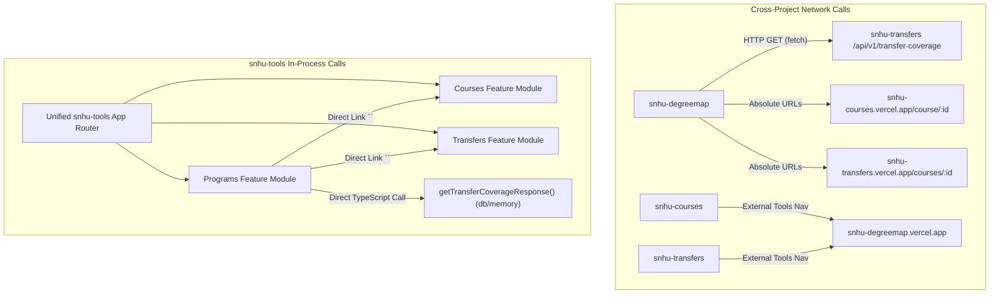
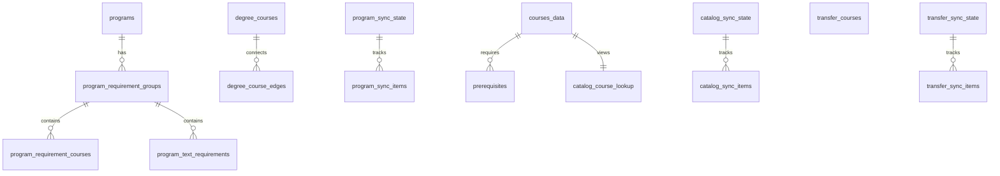
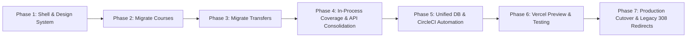

# SNHU Tools Consolidation & Migration Architecture Inventory

**Date:** 2026-08-31  
**Target Repository:** `andrewtryder/snhu-tools` (`/Users/atr/code/snhu-tools`)  
**Source Repositories:**
- `snhu-degreemap` (`/Users/atr/code/snhu-degreemap`)
- `snhu-courses` (`/Users/atr/code/snhu-courses`)
- `snhu-transfers` (`/Users/atr/code/snhu-transfers`)

---

## 1. Repository Baselines

| Attribute | `snhu-degreemap` | `snhu-courses` | `snhu-transfers` | `snhu-tools` (Target) |
| :--- | :--- | :--- | :--- | :--- |
| **Repository Directory** | `~/code/snhu-degreemap` | `~/code/snhu-courses` | `~/code/snhu-transfers` | `~/code/snhu-tools` |
| **Current Branch** | `master` | `master` | `master` | `integration/snhu-tools` |
| **Commit SHA** | `2600c316caef72329be7db0950f9d47201eacefd` | `5fdf3b44d27496a8cbb1cdf1609190584890844f` | `db1024b6e4a69c963126ed848318bc5817b2c94b` | `2600c316caef72329be7db0950f9d47201eacefd` |
| **Package Name** | `snhu-degreemap` | `nextjs-app` | `next-app` | `snhu-degreemap` *(to be renamed)* |
| **Version** | `0.1.0` | `0.1.0` | `0.1.0` | `0.1.0` |
| **Next.js Version** | `^16.3.2` | `^16.3.2` | `16.3.2` | `^16.3.2` |
| **React Version** | `^19.2.4` | `19.2.8` | `19.2.8` | `^19.2.4` |
| **Node Version Requirement** | `>=24.0.0` | `>=24.0.0` | `24.x` | `>=24.0.0` |
| **Package Manager** | `npm` | `npm` | `npm` | `npm` |
| **Core Dependencies** | `@xyflow/react` (12.11.3), `@dagrejs/dagre` (3.1.1), `html-to-image` (1.11.13), `pg` (8.23.0), `@vercel/functions` (3.9.5), `@vercel/analytics` (2.0.1), `@honeybadger-io/nextjs` (5.11.2), `lucide-react` (1.33.0), `cheerio` (1.2.0) | `@xyflow/react` (12.11.3), `@dagrejs/dagre` (3.1.1), `pg` (8.16.3), `@vercel/functions` (3.9.5), `@vercel/analytics` (2.0.1), `@vercel/speed-insights` (2.0.0), `@honeybadger-io/nextjs` (5.11.2), `@honeybadger-io/react` (6.1.32), `lucide-react` (1.33.0), `cheerio` (1.2.0) | `drizzle-orm` (0.45.2), `pg` (8.23.0), `@vercel/functions` (3.9.5), `@vercel/analytics` (2.0.1), `@vercel/speed-insights` (2.0.0), `@honeybadger-io/nextjs` (5.11.2), `@honeybadger-io/react` (6.1.32), `lucide-react` (1.33.0) | Originates from `snhu-degreemap` baseline (identical tree & dependencies) |
| **Build Command** | `next build` | `next build` | `next build` | `next build` |
| **Lint Command** | `eslint` | `eslint` | `eslint` | `eslint` |
| **Typecheck Command** | Integrated in `next build` + Vitest typecheck (`tsconfig.vitest.json`) | Integrated in `next build` | Integrated in `next build` | Integrated in `next build` + Vitest typecheck |
| **Test Runner & Commands** | `vitest run` / `vitest` | `vitest run` | `jest` / `jest --watch` | `vitest run` / `vitest` |
| **Runtime & Bundler** | Node.js 24 + Turbopack (Next 16 App Router) | Node.js 24 + Turbopack (Next 16 App Router) | Node.js 24 + Turbopack (Next 16 App Router) | Node.js 24 + Turbopack (Next 16 App Router) |

> [!NOTE]
> `snhu-tools` was initialized directly as a fork/clone of `snhu-degreemap` at commit `2600c316caef72329be7db0950f9d47201eacefd`. Degree Map serves as the host application shell into which Courses and Transfers will be consolidated.

---

## 2. Public Route Inventory & Mapping

### Route Mapping & SEO Preservation Matrix

| Source Repo | Source Route | Route Type | Rendering & Caching Behavior | Proposed Canonical Route (`snhu-tools`) | Legacy Redirect / SEO Notes |
| :--- | :--- | :--- | :--- | :--- | :--- |
| **Degree Map** | `/` | Static / ISR | On-demand ISR (`revalidate = false`, tagged `program-data`) | `/` | Primary portal landing page. Retains Degree Map hero, search, and featured bachelor degree cards. |
| **Degree Map** | `/programs` | Static / ISR | On-demand ISR (`revalidate = false`, tagged `program-data`) | `/programs` | Canonical program directory with level filters and program search. |
| **Degree Map** | `/programs/bachelors` | Static / ISR | On-demand ISR (`revalidate = false`) | `/programs/bachelors` | Level category filter landing page. |
| **Degree Map** | `/programs/associate` | Static / ISR | On-demand ISR (`revalidate = false`) | `/programs/associate` | Level category filter landing page. |
| **Degree Map** | `/programs/graduate` | Static / ISR | On-demand ISR (`revalidate = false`) | `/programs/graduate` | Level category filter landing page. |
| **Degree Map** | `/programs/certificates` | Static / ISR | On-demand ISR (`revalidate = false`) | `/programs/certificates` | Level category filter landing page. |
| **Degree Map** | `/programs/[slug]` | Dynamic / SSG | `generateStaticParams()`, on-demand ISR (`revalidate = false`) | `/programs/[slug]` | Interactive degree prerequisite/requirement graph visualizer with live transfer coverage summary. |
| **Degree Map** | `/programs/[slug]/requirements` | Dynamic / SSG | `generateStaticParams()`, on-demand ISR (`revalidate = false`) | `/programs/[slug]/requirements` | Crawlable text and course requirement breakdown. |
| **Degree Map** | `/about` | Static | Static page | `/about` | Unified About page combining methodology, disclaimers, and project documentation across all tools. |
| **Degree Map** | `/methodology` | Static | Static page | `/methodology` | Program parsing and prerequisite graph construction methodology. |
| **Degree Map** | `/data-status` | Dynamic / ISR | ISR 300s (`revalidate = 300`) | `/data-status` | Displays live sync status and catalog metadata across Programs, Courses, and Transfers. |
| **Degree Map** | `/robots.ts` | Metadata | Dynamic via site URL helper | `/robots.txt` | Unified robots.txt allowing all non-API paths. |
| **Degree Map** | `/sitemap.ts` | Metadata | Dynamic / ISR with DB fallback | `/sitemap.xml` | Consolidated sitemap including all Programs, Courses, and Transfer routes. |
| **Degree Map** | `/opengraph-image.tsx` | Metadata | Dynamic image generation | `/opengraph-image` | Root Open Graph image. |
| **Degree Map** | `/twitter-image.tsx` | Metadata | Dynamic image generation | `/twitter-image` | Root Twitter card image. |
| **Courses** | `/` | Dynamic / Cached | Server rendered with cached DB queries (`unstable_cache`) | `/courses` | Becomes `/courses` in unified app. Legacy `snhu-courses.vercel.app/` redirects to `https://snhu-tools.vercel.app/courses`. |
| **Courses** | `/courses` | Dynamic / Cached | Server rendered directory table with `unstable_cache` | `/courses` *(unified directory)* | Combines course search table with course catalog browser. |
| **Courses** | `/course/[id]` | Dynamic / Cached | Server rendered with `unstable_cache` + `React.cache` | `/courses/[id]` | **Route Normalization**: Courses detail route shifts from singular `/course/[id]` to plural `/courses/[id]`. `/course/[id]` will 308 redirect to `/courses/[id]`. |
| **Courses** | `/about` | Static | Static page | Merged into `/about` | Merged into canonical `/about`. |
| **Courses** | `/course/[id]/opengraph-image.tsx` | Metadata | Dynamic OG image | `/courses/[id]/opengraph-image` | Preserved for rich course previews. |
| **Transfers** | `/` | Dynamic / Cached | Server rendered (`connection()` + `unstable_cache`) | `/transfers` | Becomes `/transfers` in unified app. Legacy `snhu-transfers.vercel.app/` redirects to `https://snhu-tools.vercel.app/transfers`. |
| **Transfers** | `/browse` | Dynamic / Cached | Server rendered directory hub (`connection()`) | `/transfers/browse` (or alias `/transfers`) | Directory linking to subjects, organizations, levels, and course equivalencies. |
| **Transfers** | `/courses` | Dynamic / Cached | Server rendered directory (`connection()`) | `/transfers/courses` | Lists SNHU courses having transfer equivalencies. |
| **Transfers** | `/courses/[courseNumber]` | Dynamic / Cached | Server rendered (`connection()`) | `/transfers/courses/[courseNumber]` | Course equivalency page (e.g. `/transfers/courses/cs110`). Legacy `snhu-transfers.vercel.app/courses/:code` 308 redirects here. |
| **Transfers** | `/subjects` | Dynamic / Cached | Server rendered directory (`connection()`) | `/transfers/subjects` | Lists subjects with transfer equivalencies. |
| **Transfers** | `/subjects/[subject]` | Dynamic / Cached | Server rendered (`connection()`) | `/transfers/subjects/[subject]` | Subject equivalency page (e.g. `/transfers/subjects/cs`). Legacy `snhu-transfers.vercel.app/subjects/:sub` 308 redirects here. |
| **Transfers** | `/organizations` | Dynamic / Cached | Server rendered directory (`connection()`) | `/transfers/organizations` | Lists external providers (Sophia, StraighterLine, etc.). |
| **Transfers** | `/organizations/[organization]` | Dynamic / Cached | Server rendered (`connection()`) | `/transfers/organizations/[organization]` | Organization equivalency page. Legacy `snhu-transfers.vercel.app/organizations/:org` 308 redirects here. |
| **Transfers** | `/levels` | Dynamic / Cached | Server rendered directory (`connection()`) | `/transfers/levels` | Lists academic levels (undergraduate, graduate). |
| **Transfers** | `/levels/[level]` | Dynamic / Cached | Server rendered (`connection()`) | `/transfers/levels/[level]` | Level equivalency page. Legacy `snhu-transfers.vercel.app/levels/:lvl` 308 redirects here. |
| **Transfers** | `/about` | Static | Static page | Merged into `/about` | Merged into canonical `/about`. |

---

## 3. API Inventory

| Source Repo | Route Path | HTTP Methods | Parameters / Body | Output Contract | Internal Consumers | External / Legacy Consumers | Caching & Invalidation | Database Dependencies | Recommendation |
| :--- | :--- | :--- | :--- | :--- | :--- | :--- | :--- | :--- | :--- |
| `snhu-degreemap` | `/api/revalidate` | `POST` | Header: `Authorization: Bearer <SECRET>` or `X-Revalidate-Secret: <SECRET>` | `{ revalidated: true, tag: "program-data", timestamp: string }` | CircleCI `program:sync` | None | `force-dynamic`, invalidates `program-data` cache tag | `program_sync_state` | **Consolidate**: Unified `/api/revalidate` accepting `tag` or revalidating all domain tags (`program-data`, `catalog-data`, `transfer-data`). |
| `snhu-degreemap` | `/api/search` | `GET` | Query: `q` (string, min 2 chars), `limit` (max 30), `level` (optional) | `{ results: DegreeProgram[], query: string, count: number }` | Client-side search autocomplete / dialogs | None | Dynamic server response, calls `searchPrograms` | `programs`, `program_requirement_courses` | **Keep & Expand**: Maintain `/api/search` and optionally expand to search across programs, courses, and transfer partners. |
| `snhu-courses` | `/api/revalidate` | `POST` | Header: `Authorization: Bearer <SECRET>` | `{ revalidated: true, tag: "catalog-data", paths: string[], revalidatedAt: string }` | CircleCI `catalog:sync` | None | Invalidates tag `catalog-data` and paths | `catalog_sync_state` | **Merge** into unified `/api/revalidate`. |
| `snhu-courses` | `/api/courses` | `GET` | None | JSON array of all course summaries | Client-side graph / search dropdowns | External widgets / scripts | `unstable_cache` (tag `catalog-data`) | `courses_data`, `prerequisites` | **Internalize + Retain**: Export shared function `getAllCourseSummaries()` and keep route for public consumer compatibility. |
| `snhu-courses` | `/api/courses/search` | `GET` | Query: `q` | Course search results | `CourseSearchInput.tsx` | None | In-memory search over cached courses | `courses_data` | **Internalize + Retain**: Export `searchCourses()` internal function; route remains available. |
| `snhu-courses` | `/api/course/[id]` | `GET` | Path: `id` (e.g. `CS110` or `CS 110`) | `{ course: CourseData, directPrerequisites: CourseSummary[], dependentCourses: CourseSummary[] }` | Course graph client interactions | External links | Cached via `getCourseByIdCached` | `courses_data`, `prerequisites` | **Internalize + Retain**: Export `getCourseDetails(id)` internal function. |
| `snhu-courses` | `/api/course-tree/[id]` | `GET` | Path: `id` | `{ tree: CourseNode }` (full recursive prerequisite tree) | `CoursePrerequisiteGraph.tsx` | External consumers | Cached via `getCourseTreeCached` | `courses_data`, `prerequisites` | **Internalize + Retain**: Export `getCourseTree(id)` internal function. |
| `snhu-courses` | `/api/course-trees/[ids]` | `GET` | Path: `ids` (comma-separated list) | `{ trees: CourseNode[], errors: Array<{ id, code, message }> }` | Multi-course prerequisite viewer | External consumers | Cached per ID | `courses_data`, `prerequisites` | **Internalize + Retain**: Export `getCourseTrees(ids)` internal function. |
| `snhu-courses` | `/api/cron/catalog-sync` | `GET` | Header: `Authorization: Bearer <CRON_SECRET>` | `{ action: 'batch' \| 'promoted' \| 'skipped' \| 'error', ... }` | Vercel Cron (legacy backup) | None | `maxDuration = 60`, `no-store` | `courses_data_stage`, `catalog_sync_state` | **Retire or Retain for Vercel Cron**: CircleCI handles primary batching; if retained, rename to `/api/cron/catalog-sync`. |
| `snhu-transfers` | `/api/revalidate` | `POST` | Header: `Authorization: Bearer <SECRET>` | `{ revalidated: true, tag: "transfer-data", timestamp: string }` | CircleCI `transfer:sync` | None | Invalidates tag `transfer-data` | `transfer_sync_state` | **Merge** into unified `/api/revalidate`. |
| `snhu-transfers` | `/api/v1/transfer-coverage` | `GET` | Query: `courses` (comma-separated, max 100 codes, max 2000 chars) | `{ schemaVersion: 1, dataLastUpdatedAt: string \| null, requestedCourseCount: number, matchedCourseCount: number, courses: TransferCoverageCourse[] }` | **`snhu-degreemap`** (`transferCoverage.server.ts`) | Public external consumers | `public, s-maxage=300, stale-while-revalidate=3600` | `transfer_courses`, `transfer_sync_state` | **CRITICAL INTEGRATION**: In `snhu-tools`, replace the cross-app HTTP `fetch()` with direct in-process call to `getTransferCoverageResponse(codes)` while **retaining `/api/v1/transfer-coverage`** as a public API endpoint. |

---

## 4. Cross-Project Dependencies

### Cross-Project Inventory & Resolution Plan



1. **Degree Map $\rightarrow$ Transfers HTTP Transfer Coverage API (`TRANSFER_COVERAGE_API_URL`)**:
   - *Current Implementation*: `snhu-degreemap/src/lib/transferCoverage.server.ts` issues batch HTTP `fetch()` requests (batches of 100 courses) to `https://snhu-transfers.vercel.app/api/v1/transfer-coverage`.
   - *Failure Mode*: Network latency, timeout (5000ms), 503 fallback if endpoint is down.
   - *Unified Plan*: Replace with a direct in-process TypeScript call to `getTransferCoverageResponse(courseCodes)` from the unified database layer. Eliminates all network overhead, serialization latency, and HTTP failure modes. Keep `/api/v1/transfer-coverage` route handler for backwards compatibility with external API consumers.
2. **Degree Map $\rightarrow$ Courses Absolute Course Links (`getCoursesUrlForCourse`)**:
   - *Current Implementation*: `src/lib/transferIntegration.ts` creates external links pointing to `https://snhu-courses.vercel.app/course/${codeSlug}`.
   - *Unified Plan*: Replace with Next.js client-side `<Link href={`/courses/${codeSlug}`}>`.
3. **Degree Map $\rightarrow$ Transfers Absolute Course Transfer Links (`getTransferUrlForCourse`)**:
   - *Current Implementation*: `src/lib/transferIntegration.ts` creates external links pointing to `https://snhu-transfers.vercel.app/courses/${codeSlug}`.
   - *Unified Plan*: Replace with Next.js client-side `<Link href={`/transfers/courses/${codeSlug}`}>`.
4. **Header / Footer SNHU Tools Navigation Dropdown (`SNHU_TOOLS`)**:
   - *Current Implementation*: Duplicated `SNHUToolsNav.tsx` in all three repositories rendering hardcoded external links to `snhu-courses.vercel.app`, `snhu-transfers.vercel.app`, and `snhu-degreemap.vercel.app`.
   - *Unified Plan*: Modernize the main navigation bar in `AppHeader.tsx` to first-class internal navigation tabs:
     **Programs** (`/programs`) | **Courses** (`/courses`) | **Transfers** (`/transfers`) | **About** (`/about`).

---

## 5. Design System Inventory

### Design Tokens Comparison (`globals.css`)

All three repositories utilize Tailwind CSS v4 (`@import "tailwindcss";`) with identical `@theme inline` CSS custom properties:

```css
@theme inline {
  --color-primary: #001d59;
  --color-primary-container: #003087;
  --color-on-primary: #ffffff;
  --color-on-primary-container: #7f9df8;
  --color-primary-fixed: #dbe1ff;
  --color-primary-fixed-dim: #b4c5ff;
  --color-secondary: #0053cf;
  --color-secondary-container: #2c6cf0;
  --color-on-secondary: #ffffff;
  --color-on-secondary-container: #fefcff;
  --color-secondary-fixed: #dae2ff;
  --color-secondary-fixed-dim: #b2c5ff;
  --color-tertiary: #002908;
  --color-tertiary-container: #004112;
  --color-on-tertiary: #ffffff;
  --color-on-tertiary-container: #3cb752;
  --color-tertiary-fixed: #83fc8e;
  --color-tertiary-fixed-dim: #66df75;
  --color-background: #fbf9f8;
  --color-surface: #fbf9f8;
  --color-surface-bright: #fbf9f8;
  --color-surface-dim: #dcd9d9;
  --color-surface-container: #f0eded;
  --color-surface-container-low: #f6f3f2;
  --color-surface-container-lowest: #ffffff;
  --color-surface-container-high: #eae8e7;
  --color-surface-container-highest: #e4e2e1;
  --color-surface-variant: #e4e2e1;
  --color-surface-tint: #3959b0;
  --color-on-background: #1b1c1c;
  --color-on-surface: #1b1c1c;
  --color-on-surface-variant: #444652;
  --color-outline: #747683;
  --color-outline-variant: #c4c6d4;
  --color-error: #ba1a1a;
  --color-error-container: #ffdad6;
  --color-on-error: #ffffff;
  --color-on-error-container: #93000a;
  --color-inverse-surface: #303030;
  --color-inverse-on-surface: #f3f0f0;
  --color-inverse-primary: #b4c5ff;

  --font-sans: var(--font-inter), ui-sans-serif, system-ui, sans-serif;
  --font-headline: var(--font-geist), var(--font-inter), ui-sans-serif, system-ui, sans-serif;

  --radius-sm: 0.125rem;
  --radius-md: 0.25rem;
  --radius-lg: 0.5rem;
  --radius-full: 0.75rem;

  --spacing-gutter: 24px;
  --spacing-container-max: 1280px;
}
```

### Component Comparison & Canonical Selection

| Component Primitive | `snhu-degreemap` | `snhu-courses` | `snhu-transfers` | Recommended Canonical Source | Migration Notes |
| :--- | :--- | :--- | :--- | :--- | :--- |
| **`Button`** | `src/components/ui/Button.tsx` (Variants: `primary`, `secondary`, `outline`, `ghost`, `danger`; Sizes: `sm`, `md`, `lg`) | Inline utility classes | Inline utility classes | `snhu-degreemap` (`src/components/ui/Button.tsx`) | Standardize all button instances across Courses and Transfers onto this primitive. |
| **`Card`** | `src/components/ui/Card.tsx` (Header, Title, Description, Content, Footer) | Inline utility classes | Inline utility classes | `snhu-degreemap` (`src/components/ui/Card.tsx`) | Use for course summaries, equivalency cards, and program cards. |
| **`Badge`** | `src/components/ui/Badge.tsx` (Variants: `default`, `primary`, `secondary`, `tertiary`, `outline`, `error`, `surface`) | Inline utility classes | Inline utility classes | `snhu-degreemap` (`src/components/ui/Badge.tsx`) | Used for credit counts, course levels, prerequisite indicators, and transfer provider tags. |
| **`Dialog`** | `src/components/ui/Dialog.tsx` (Modal with backdrop blur, keyboard trap, ESC close, ARIA) | `AboutModal.tsx` | Inline modal | `snhu-degreemap` (`src/components/ui/Dialog.tsx`) | Replace custom `AboutModal` in Courses with the canonical `Dialog`. |
| **`Tabs`** | `src/components/ui/Tabs.tsx` | None | `ViewTabs` in `AppHeader.tsx` | `snhu-degreemap` (`src/components/ui/Tabs.tsx`) | Standard accessible tab list and tab panels. |
| **`SearchInput`** | `src/components/ui/SearchInput.tsx` | `CourseSearchInput.tsx` | `GlobalSearchForm` / `ControlledSearchInput` in `AppHeader` | `snhu-degreemap` (`src/components/ui/SearchInput.tsx`) + `CourseSearchInput.tsx` | Generalize `SearchInput` for global header search; keep `CourseSearchInput` for specialized course-code autocomplete. |
| **`MetricCard`** | `src/components/ui/MetricCard.tsx` | Inline metrics | Inline stat counters in `ClientPage.tsx` | `snhu-degreemap` (`src/components/ui/MetricCard.tsx`) | Standardize stat boxes across Transfers homepage and Programs. |
| **`EmptyState`** | `src/components/ui/EmptyState.tsx` | Inline empty message | Inline empty message | `snhu-degreemap` (`src/components/ui/EmptyState.tsx`) | Reusable empty search and filter state component. |
| **`BrandBadge`** | `src/components/BrandBadge.tsx` | Inline brand markup | Inline brand markup | `snhu-degreemap` (`src/components/BrandBadge.tsx`) | Parameterize or unify to show `SNHU Tools` with active product subtitle. |
| **`AppHeader`** | `src/components/AppHeader.tsx` | `src/components/AppHeader.tsx` | `src/components/AppHeader.tsx` | Unified Header (based on Degree Map shell) | Integrate unified navigation links: Programs, Courses, Transfers, About. |
| **`AppFooter`** | `src/components/AppFooter.tsx` | `src/components/AppFooter.tsx` | `src/components/AppFooter.tsx` | `snhu-degreemap` (`src/components/AppFooter.tsx`) | Has cleanest layout with disclaimer, repository source link, and dynamic build/sync timestamp. |
| **Graph Components** | `src/components/graph/*` (`@xyflow/react` + Dagre) | `CoursePrerequisiteGraph.tsx` (`@xyflow/react` + Dagre) | None | Co-exist under `src/components/graph/` and `src/features/courses/` | Degree Map renders multi-section program graphs; Courses renders single-course prerequisite & dependent trees. Both use `@xyflow/react` 12.11.3 and Dagre 3.1.1. |
| **`EquivalencyTable`** | None | None | `src/components/EquivalencyTable.tsx` | `snhu-transfers` (`src/components/EquivalencyTable.tsx`) | Product-specific primitive for transfer data tables. |

---

## 6. Application Shell and Navigation

### Current Shell Comparison

- **`snhu-degreemap`**:
  - Sticky header with `BrandBadge` ("SNHU Degree Map"), top nav (`Programs`, `About`), global search input (searches degree programs and prerequisites), "Browse Programs" button triggering `ProgramBrowserDialog`, and `SNHUToolsNav` tools menu.
  - Sticky/fixed footer with catalog update timestamp, unofficial disclaimer, and links to `/programs`, `/about`, and GitHub repo.
- **`snhu-courses`**:
  - Sticky header with Brand badge ("SNHU Course Prerequisites"), breadcrumbs (`About`, `Directory`), course search input with autocomplete, and `SNHUToolsNav`.
  - Footer with last updated date, disclaimer, and links.
- **`snhu-transfers`**:
  - Sticky header with Brand badge ("SNHU Transfer Equivalencies"), search input, view tabs (`Subject`, `Course`, `Partner`, `Level`), and `SNHUToolsNav`.
  - Fixed footer with last published date, disclaimer, and links to `/browse`, `/about`, and source code.

### Proposed Unified Shell (`snhu-tools`)

```
+---------------------------------------------------------------------------------------------------------+
| [SNHU Tools Brand]   Programs   Courses   Transfers   About   | [ Search programs, courses, transfers ] |
+---------------------------------------------------------------------------------------------------------+
|                                                                                                         |
|                                         <Active Feature View>                                           |
|                                                                                                         |
+---------------------------------------------------------------------------------------------------------+
| Last Updated: Aug 31, 2026 | Unofficial SNHU Tool | Programs · Courses · Transfers · About · GitHub     |
+---------------------------------------------------------------------------------------------------------+
```

1. **Header Navigation**:
   - Brand logo/badge: `SNHU Tools` (links to `/`).
   - Primary Nav items:
     - **Programs** (`/programs` or `/` - active on `/`, `/programs`, `/programs/[slug]`, `/programs/[slug]/requirements`)
     - **Courses** (`/courses` - active on `/courses`, `/courses/[id]`)
     - **Transfers** (`/transfers` - active on `/transfers`, `/transfers/courses/*`, `/transfers/organizations/*`, `/transfers/subjects/*`, `/transfers/levels/*`)
     - **About** (`/about` - active on `/about`, `/methodology`, `/data-status`)
   - Search bar: Multi-mode or context-aware search (defaults to global search across programs & courses).
   - Eliminate `SNHUToolsNav` dropdown as external tool hopping is replaced with instant in-app navigation.
2. **Footer**:
   - Single unified footer displaying synchronized data freshness across all three catalogs, standard legal disclaimer, and quick links to the 4 main sections.

---

## 7. Database Architecture

### Inventory by Domain



| Domain | Query Layer | Client / Pool Implementation | Tables (Live) | Tables (Staging) | Sync State Tables | Views |
| :--- | :--- | :--- | :--- | :--- | :--- | :--- |
| **Programs** (`snhu-degreemap`) | Raw SQL (`pg.Pool`) | `src/lib/db/pool.ts`, `src/lib/db/client.ts`, `src/lib/db/ssl.ts` (`max: 1`, `attachDatabasePool`) | `programs`, `program_requirement_groups`, `program_requirement_courses`, `program_text_requirements`, `degree_courses`, `degree_course_edges` | `programs_stage`, `program_requirement_groups_stage`, `program_requirement_courses_stage`, `program_text_requirements_stage`, `degree_courses_stage`, `degree_course_edges_stage` | `program_sync_state`, `program_sync_items` | None |
| **Courses** (`snhu-courses`) | Raw SQL (`pg.Pool`) + SQL helper | `src/lib/db/pool.ts`, `src/lib/db/client.ts`, `src/lib/db/ssl.ts`, `src/lib/db/sql.ts` (`max: 1`, `attachDatabasePool`) | `courses_data`, `prerequisites` | `courses_data_stage`, `prerequisites_stage` | `catalog_sync_state`, `catalog_sync_items` | `catalog_course_lookup` |
| **Transfers** (`snhu-transfers`) | Drizzle ORM (`drizzle(pool)`) + Raw SQL | `src/db/pool.ts`, `src/db/client.ts`, `src/db/ssl.ts`, `src/db/schema.ts`, `src/db/index.ts` (`max: 1`, `attachDatabasePool`) | `transfer_courses` | `transfer_courses_stage` | `transfer_sync_state`, `transfer_sync_items` | None |

### Key Findings & Topology Analysis

1. **Complete Table Disjointness**:
   - There are **ZERO table name collisions** between the three systems.
   - Programs tables are prefixed `program_*` or `degree_*`.
   - Courses tables are named `courses_data*`, `prerequisites*`, `catalog_sync_*`.
   - Transfers tables are named `transfer_courses*`, `transfer_sync_*`.
2. **Identical Connection Pooling & TLS Strategy**:
   - All three projects use identical connection configuration logic in `ssl.ts` (stripping query parameters, resolving inline or filesystem PEM CA certs via `POSTGRES_CA_CERT`, enforcing `rejectUnauthorized: true`).
   - All three projects configure connection pool `POOL_OPTIONS = { max: 1, idleTimeoutMillis: 5_000, connectionTimeoutMillis: 5_000 }` with `@vercel/functions` `attachDatabasePool(pool)`.
3. **Database Topology**:
   - In production, the three systems currently run against separate connection strings / databases via their respective Vercel project environment variables (`POSTGRES_URL`).
   - Because all table names, staging tables, and sync state tables are completely distinct, the unified application can either connect to a single consolidated PostgreSQL database holding all tables, or query the distinct schemas if maintained separately.
4. **ORM & Query Tooling**:
   - `snhu-degreemap` and `snhu-courses` use typed raw SQL queries with `pg`.
   - `snhu-transfers` uses `drizzle-orm` (version `^0.45.2`) with schema definitions in `src/db/schema.ts`.
   - `snhu-tools` can seamlessly support both Drizzle ORM and raw `pg` queries concurrently against the shared pool.

---

## 8. Data Synchronization and Ingestion

### Synchronization Jobs Inventory

| Script / Command | Source Repo | External Data Source | Staging Tables Written | Live Tables Promoted To | Schedule / Execution | Safe Failure & Guardrails | Independence After Consolidation |
| :--- | :--- | :--- | :--- | :--- | :--- | :--- | :--- |
| `npm run program:sync`<br>`scripts/program-sync.ts` | `snhu-degreemap` | Kuali Catalog API (`KUALI_BASE_URL`, `KUALI_CATALOG_ID`) | `programs_stage`, `program_requirement_*_stage`, `degree_*_stage` | `programs`, `program_requirement_*`, `degree_*` | CircleCI scheduled / on-demand pipeline | Distributed lease lock (`program_sync_state`), transactional promotion, 25% shrink guard (`--allow-large-shrink`), artifact validation (`validate-sync-result.mjs`). | **Yes** (Can run as independent command / workflow job). |
| `npm run program:bootstrap`<br>`scripts/program-bootstrap.ts` | `snhu-degreemap` | Kuali Catalog API | Stage & promote all active programs | Live program tables | One-off / Cold start | Idempotent table wipe and complete catalog import. | **Yes**. |
| `npm run catalog:sync`<br>`scripts/catalog-sync.ts` | `snhu-courses` | Kuali Course API | `courses_data_stage`, `prerequisites_stage` | `courses_data`, `prerequisites` | CircleCI scheduled workflow | Distributed lease lock (`catalog_sync_state`), batch processing, transactional swap, artifact logging. | **Yes** (Can run as independent command / workflow job). |
| `npm run catalog:bootstrap`<br>`scripts/catalog-bootstrap.ts` | `snhu-courses` | Kuali Course API | `courses_data_stage`, `prerequisites_stage` | Live course tables | One-off / Cold start | Complete catalog fetch and stage/promote loop. | **Yes**. |
| `npm run transfer:sync`<br>`scripts/transfer-sync.ts` | `snhu-transfers` | SNHU Transfer Equivalencies Web / API Portal | `transfer_courses_stage` | `transfer_courses` | CircleCI scheduled workflow | Distributed lease lock (`transfer_sync_state`), pagination batching, 25% live-shrink guard (`--allow-large-shrink`), artifact validation (`validate-transfer-sync-result.mjs`). | **Yes** (Can run as independent command / workflow job). |
| `npm run transfer:bootstrap`<br>`scripts/transfer-bootstrap.ts` | `snhu-transfers` | SNHU Transfer Portal | `transfer_courses_stage` | Live transfer tables | One-off / Cold start | Complete bootstrap run to completion. | **Yes**. |
| `npm run db:migrate`<br>`scripts/migrate.ts` | All Repos | Local schema definitions | PostgreSQL Database DDL | PostgreSQL Database DDL | Pre-sync step in CircleCI and deployments | Idempotent `CREATE TABLE IF NOT EXISTS`, `CREATE INDEX IF NOT EXISTS`, `ALTER TABLE ADD COLUMN IF NOT EXISTS`. | **Yes** (Consolidate into single unified migration script). |

---

## 9. CircleCI Inventory

### Workflows and Jobs Matrix

| Repository | Workflow Name | Job Name | Trigger / Schedule | Context Referenced | Environment Variable Names Used | Steps Executed |
| :--- | :--- | :--- | :--- | :--- | :--- | :--- |
| **`snhu-degreemap`** | `catalog_sync_workflow` | `sync_program_catalog` | Parameter `run_program_sync` | `snhu-degreemap-sync-context` | `POSTGRES_URL`, `POSTGRES_CA_CERT`, `KUALI_BASE_URL`, `KUALI_CATALOG_ID`, `REVALIDATE_SECRET`, `SITE_URL` | `npm ci`, `npm run db:migrate`, `npm run program:sync`, `validate-sync-result.mjs`, POST `/api/revalidate` on promotion, store artifacts `/tmp/sync-results`. |
| **`snhu-courses`** | `scheduled-catalog-sync` | `sync-course-catalog` | Scheduled / branch `master` | `snhu-courses-sync` | `POSTGRES_URL`, `POSTGRES_CA_CERT`, `REVALIDATE_SECRET`, `SITE_URL` | `npm ci`, `npm run db:migrate`, `npm run catalog:sync`, POST `/api/revalidate` on promotion. |
| **`snhu-transfers`** | `scheduled-transfer-sync` | `sync-transfer-data` | Parameter `run_transfer_sync` & `master` | `snhu-transfers-sync` | `POSTGRES_URL`, `POSTGRES_CA_CERT`, `REVALIDATE_SECRET`, `SITE_URL` | `npm ci`, `npm run db:migrate`, `npm run transfer:sync`, `validate-transfer-sync-result.mjs`, POST `/api/revalidate` on promotion, store artifacts `/tmp/sync-results`. |

### CircleCI Consolidation Recommendation

1. **Unified Pipeline Configuration**:
   - Maintain independent execution parameters (`run_program_sync`, `run_course_sync`, `run_transfer_sync`).
   - Define dedicated jobs: `sync_programs`, `sync_courses`, `sync_transfers`, and `sync_all`.
   - Create a unified CircleCI context: `snhu-tools-sync-context` (or retain individual contexts during transition).
   - Standardize artifact capture and validation scripts across all three sync routines.

---

## 10. Vercel-Specific Behavior

| Feature / Setting | `snhu-degreemap` | `snhu-courses` | `snhu-transfers` | Proposed Unified `snhu-tools` |
| :--- | :--- | :--- | :--- | :--- |
| **Runtime** | Node.js 24 (Turbopack) | Node.js 24 (Turbopack) | Node.js 24 (Turbopack) | Node.js 24 (Turbopack) |
| **Security Headers (`vercel.json`)** | `X-Content-Type-Options: nosniff`, `X-Frame-Options: DENY`, `X-XSS-Protection: 1; mode=block`, `Referrer-Policy: strict-origin-when-cross-origin` | None in `vercel.json` | `$schema` only | Inherit full security headers from `snhu-degreemap/vercel.json`. |
| **Redirects (`next.config`)** | `/programs/bachelor` $\rightarrow$ `/programs/bachelors` (308)<br>`/programs/certificate` $\rightarrow$ `/programs/certificates` (308) | None in `next.config` | None in `next.config` | Include legacy program redirects + `/course/:id` $\rightarrow$ `/courses/:id` + `/browse` $\rightarrow$ `/transfers/browse`. |
| **Fluid Compute / Concurrency** | Standard serverless with `attachDatabasePool(pool)` | Standard serverless with `attachDatabasePool(pool)` | Standard serverless with `attachDatabasePool(pool)` | Standard serverless with `attachDatabasePool(pool)` to maintain connection reuse across invocations. |
| **Analytics & Web Vitals** | `@vercel/analytics` | `@vercel/analytics`, `@vercel/speed-insights` | `@vercel/analytics`, `@vercel/speed-insights` | `@vercel/analytics` + `@vercel/speed-insights`. |
| **Revalidation Mechanism** | Tag `program-data` | Tag `catalog-data` + static paths | Tag `transfer-data` | Unified on-demand tag revalidation for `program-data`, `catalog-data`, `transfer-data`. |

---

## 11. Caching and Rendering Analysis

### Rendering & Caching Strategy by Route Family

| Route Family | Data Fetching Pattern | Cache Layer | Invalidation Trigger | DB Connection Impact |
| :--- | :--- | :--- | :--- | :--- |
| **`/` & `/programs`** | Static / Pre-rendered SSG | `unstable_cache(..., ['programs-list'], { tags: ['program-data'], revalidate: false })` + `React.cache()` | On-demand POST `/api/revalidate` (`program-data`) | Zero DB load on normal traffic (served from Vercel Edge / Data Cache). |
| **`/programs/[slug]`** | `generateStaticParams()` SSG | `unstable_cache(..., ['program-detail', slug], { tags: ['program-data'], revalidate: false })` + `React.cache()` | On-demand POST `/api/revalidate` (`program-data`) | Zero DB load during steady state; single query on revalidation. |
| **`/courses` & `/courses/[id]`** | Dynamic SSR | `unstable_cache(..., ['course-detail', id], { tags: ['catalog-data'], revalidate: 86400 })` + `React.cache()` | On-demand POST `/api/revalidate` (`catalog-data`) or 24h TTL | 1 connection during cache miss, pooled via `attachDatabasePool`. |
| **`/transfers/*`** | Dynamic SSR via `connection()` | `unstable_cache(..., [...], { tags: ['transfer-data'], revalidate: 86400 })` + `React.cache()` | On-demand POST `/api/revalidate` (`transfer-data`) | 1 connection during cache miss, pooled via `attachDatabasePool`. |
| **`/api/v1/transfer-coverage`** | Dynamic Route Handler | CDN / Edge Cache: `public, s-maxage=300, stale-while-revalidate=3600` | Edge cache expiration / new query | Minimal load (cached at CDN edge). |

---

## 12. SEO Inventory

### Metadata & Structured Data Matrix

| Feature | `snhu-degreemap` | `snhu-courses` | `snhu-transfers` | Unified `snhu-tools` Strategy |
| :--- | :--- | :--- | :--- | :--- |
| **Canonical Origin** | `https://snhu-degreemap.vercel.app` (or `NEXT_PUBLIC_SITE_URL`) | `https://snhu-courses.vercel.app` (or `NEXT_PUBLIC_SITE_URL`) | `https://snhu-transfers.vercel.app` (or `NEXT_PUBLIC_SITE_URL`) | Canonical host: `https://snhu-tools.vercel.app`. |
| **Dynamic `generateMetadata`** | Enriched titles, descriptions, canonical URLs, OG image, Twitter card for all programs. | Enriched titles, descriptions, keywords, canonical URLs for all courses. | Enriched titles, descriptions, canonical URLs for subjects, orgs, levels, courses. | Standardized metadata helper across all routes with canonical `https://snhu-tools.vercel.app`. |
| **JSON-LD Structured Data** | `EducationalOccupationalProgram`, `Course`, `BreadcrumbList`, `ItemList`, `Organization`. Safe injection via `safeJsonLd.ts`. | `Course`, `BreadcrumbList`, `Organization`. Safe injection via `safeJsonLd.ts`. | `BreadcrumbList`, `ItemList`, `Organization`. Safe injection via `safeJsonLd.ts`. | Canonical `safeJsonLd` utility rendering rich schema.org structured data across all entities. |
| **Sitemap Structure** | Dynamic sitemap indexing all static pages and program routes with `lastModified` from sync state. | Dynamic sitemap indexing all courses and static pages. | Dynamic sitemap with `connection()` indexing all transfer directories and detail routes. | Unified `sitemap.ts` indexing all Programs, Courses, and Transfer routes (estimated ~3,000 URLs). |
| **Robots.txt** | Environment-aware: Allows all on production; disallows `/` on preview/staging; disallows `/api/`. | Standard robots allowing all, disallowing `/api/`. | Standard robots allowing all, disallowing `/api/`. | Adopt `snhu-degreemap` environment-aware `robots.ts` (prevents staging indexation). |

### Legacy-to-Canonical SEO Migration Table

| Legacy URL (Existing Production) | HTTP Status | Canonical Destination URL (`snhu-tools`) |
| :--- | :--- | :--- |
| `https://snhu-degreemap.vercel.app/` | 308 Permanent Redirect | `https://snhu-tools.vercel.app/` |
| `https://snhu-degreemap.vercel.app/programs` | 308 Permanent Redirect | `https://snhu-tools.vercel.app/programs` |
| `https://snhu-degreemap.vercel.app/programs/:slug` | 308 Permanent Redirect | `https://snhu-tools.vercel.app/programs/:slug` |
| `https://snhu-degreemap.vercel.app/programs/:slug/requirements` | 308 Permanent Redirect | `https://snhu-tools.vercel.app/programs/:slug/requirements` |
| `https://snhu-degreemap.vercel.app/about` | 308 Permanent Redirect | `https://snhu-tools.vercel.app/about` |
| `https://snhu-courses.vercel.app/` | 308 Permanent Redirect | `https://snhu-tools.vercel.app/courses` |
| `https://snhu-courses.vercel.app/courses` | 308 Permanent Redirect | `https://snhu-tools.vercel.app/courses` |
| `https://snhu-courses.vercel.app/course/:id` | 308 Permanent Redirect | `https://snhu-tools.vercel.app/courses/:id` |
| `https://snhu-courses.vercel.app/about` | 308 Permanent Redirect | `https://snhu-tools.vercel.app/about` |
| `https://snhu-transfers.vercel.app/` | 308 Permanent Redirect | `https://snhu-tools.vercel.app/transfers` |
| `https://snhu-transfers.vercel.app/browse` | 308 Permanent Redirect | `https://snhu-tools.vercel.app/transfers/browse` |
| `https://snhu-transfers.vercel.app/courses` | 308 Permanent Redirect | `https://snhu-tools.vercel.app/transfers/courses` |
| `https://snhu-transfers.vercel.app/courses/:code` | 308 Permanent Redirect | `https://snhu-tools.vercel.app/transfers/courses/:code` |
| `https://snhu-transfers.vercel.app/subjects` | 308 Permanent Redirect | `https://snhu-tools.vercel.app/transfers/subjects` |
| `https://snhu-transfers.vercel.app/subjects/:subject` | 308 Permanent Redirect | `https://snhu-tools.vercel.app/transfers/subjects/:subject` |
| `https://snhu-transfers.vercel.app/organizations` | 308 Permanent Redirect | `https://snhu-tools.vercel.app/transfers/organizations` |
| `https://snhu-transfers.vercel.app/organizations/:org` | 308 Permanent Redirect | `https://snhu-tools.vercel.app/transfers/organizations/:org` |
| `https://snhu-transfers.vercel.app/levels` | 308 Permanent Redirect | `https://snhu-tools.vercel.app/transfers/levels` |
| `https://snhu-transfers.vercel.app/levels/:level` | 308 Permanent Redirect | `https://snhu-tools.vercel.app/transfers/levels/:level` |
| `https://snhu-transfers.vercel.app/about` | 308 Permanent Redirect | `https://snhu-tools.vercel.app/about` |

---

## 13. Observability Architecture

### Current Observability Setups

1. **`snhu-degreemap`**:
   - Uses `@honeybadger-io/nextjs` wrapper in `next.config.js` (`setupHoneybadger(nextConfig)`).
   - No `src/instrumentation.ts` or `onRequestError`.
   - Vercel Analytics (`@vercel/analytics`).
2. **`snhu-courses` & `snhu-transfers`**:
   - Modern Next.js 16 setup using `src/instrumentation.ts` with `register()` and `onRequestError`.
   - Turbopack-safe server configuration in `honeybadger.server.config.js` and `honeybadger.browser.config.js`.
   - Sensitive parameter filters in `src/lib/monitoring/honeybadger.ts` (scrubs tokens, secrets, database URLs).
   - `@vercel/analytics` + `@vercel/speed-insights`.

### Observability Recommendation for `snhu-tools`

- **Canonical Architecture**: Adopt the modern `instrumentation.ts` + `onRequestError` + `honeybadger.server.config.js` pattern from `snhu-courses` / `snhu-transfers`.
- **Reasoning**: Next.js 16 defaults to Turbopack. Honeybadger's legacy `setupHoneybadger()` wrapper in `next.config.js` injects Webpack hooks that are incompatible with Turbopack unless explicitly overridden. Using Next.js 16's native `instrumentation.ts` hook provides clean, runtime-agnostic error capture for both server and edge without bundler hacks.

---

## 14. Testing Inventory & Quality Baseline

### Existing Test Suites

```
Total Test Suites Across All Projects: 67 passed
Total Individual Tests: 325 passed
```

- **`snhu-degreemap`** (Vitest): 43 test files, 199 tests.
  - Tests graph transformation, layout algorithms, SVG/PNG export, Kuali parser, server data fetching, SEO/metadata, canonical host resolution, and mock transfer coverage.
- **`snhu-courses`** (Vitest): 7 test files, 30 tests.
  - Tests course prerequisite trees, DB connection pool, SSL cert resolution, revalidate API route, and catalog sync persistence.
- **`snhu-transfers`** (Jest): 17 test suites, 96 tests.
  - Tests course code parsing, SEO directory queries, transfer coverage API contract, Drizzle DB queries, Honeybadger error reporting, and sync promotion/shrink guards.

### Testing Recommendations for Unified App

1. **Standardize on Vitest**:
   - Unify all test suites under Vitest (already used by `snhu-degreemap` and `snhu-courses`).
   - Migrate `snhu-transfers` 17 Jest test files to Vitest syntax (almost 1:1 mapping with `@testing-library/react` and `jsdom`).
2. **Key Coverage Gaps to Address Before Migration**:
   - End-to-end integration tests verifying in-process transfer coverage calculation against program courses.
   - Comprehensive route resolution tests ensuring unified route hierarchy (`/programs`, `/courses`, `/transfers`) handles dynamic parameters without route collisions.

---

## 15. Environment Variable Matrix

| Variable Name | `snhu-degreemap` | `snhu-courses` | `snhu-transfers` | Unified `snhu-tools` Purpose | Conflicts / Resolution |
| :--- | :---: | :---: | :---: | :--- | :--- |
| `POSTGRES_URL` | Used | Used | Used | Connection string for PostgreSQL database. | **No conflict**: Same parameter name. Points to unified or separate database. |
| `POSTGRES_CA_CERT` | Used | Used | Used | CA certificate for TLS verification (Aiven / Neon). | **No conflict**: Identical resolution in `ssl.ts`. |
| `REVALIDATE_SECRET` | Used | Used | Used | Secret token for authorized POST `/api/revalidate`. | **No conflict**: Standardize on `Authorization: Bearer <SECRET>`. |
| `HONEYBADGER_API_KEY` | - | Used | Used | Server-side Honeybadger API key. | **Adopt**: Standardize server-side key name. |
| `NEXT_PUBLIC_HONEYBADGER_API_KEY` | Used | Used | Used | Client-side Honeybadger API key. | **No conflict**: Identical usage. |
| `NEXT_PUBLIC_SITE_URL` | Used | Used | Used | Public site canonical URL. | **Canonical**: `https://snhu-tools.vercel.app`. |
| `SITE_URL` | Used | Used | - | Base URL used by CircleCI revalidation curl step. | **Canonical**: `https://snhu-tools.vercel.app`. |
| `KUALI_BASE_URL` | Used | - | - | Base URL for Kuali Catalog API. | **Retain** for Programs sync. |
| `KUALI_CATALOG_ID` | Used | - | - | Catalog ID for Kuali Program Catalog. | **Retain** for Programs sync. |
| `KUALI_CATALOG_YEAR_LABEL` | Used | - | - | Catalog Year string (e.g. "2025-2026"). | **Retain** for Programs sync. |
| `KUALI_REQUEST_TIMEOUT_MS` | Used | - | - | HTTP timeout for Kuali API requests. | **Retain**. |
| `KUALI_USER_AGENT` | Used | - | - | Custom User-Agent header for Kuali scraping. | **Retain**. |
| `TRANSFER_COVERAGE_API_URL` | Used | - | - | URL of snhu-transfers API endpoint. | **Obsolete in unified app**: Replaced with direct in-process function call. |
| `NEXT_PUBLIC_COURSES_URL` | Used | - | Used | External URL for snhu-courses links. | **Obsolete in unified app**: Replaced with internal relative links (`/courses/*`). |
| `NEXT_PUBLIC_TRANSFERS_URL` | Used | - | - | External URL for snhu-transfers links. | **Obsolete in unified app**: Replaced with internal relative links (`/transfers/*`). |
| `ENABLE_PROGRAM_FIXTURES` | Used | - | - | Allows static program fixture fallback in non-prod. | **Retain** for offline testing / development. |
| `CRON_SECRET` | - | Used | - | Vercel Cron authorization secret. | **Retain** if Vercel Cron endpoints are preserved. |
| `VERCEL_ENV` | Used | Used | Used | Vercel deployment environment (`production`, `preview`, `development`). | **System provided by Vercel**. |
| `VERCEL_GIT_COMMIT_SHA` | - | Used | Used | Commit SHA for release tracking in Honeybadger. | **System provided by Vercel**. |

---

## 16. Dependency Comparison & Reconciliation

### Dependency Classification

| Category | Packages | Version in Sources | Recommendation for `snhu-tools` |
| :--- | :--- | :--- | :--- |
| **Shared by All Three** | `next`, `react`, `react-dom`, `pg`, `@vercel/functions`, `@vercel/analytics`, `lucide-react`, `dotenv`, `tailwindcss`, `@tailwindcss/postcss`, `eslint`, `eslint-config-next`, `tsx`, `typescript` | `next@16.3.2`, `react@19.2.x`, `pg@8.x`, `tailwindcss@4` | Keep current versions; align React on `19.2.8` and `pg` on `8.23.0`. |
| **Shared by Degree Map & Courses** | `@xyflow/react`, `@dagrejs/dagre`, `cheerio` | `@xyflow/react@12.11.3`, `@dagrejs/dagre@3.1.1`, `cheerio@1.2.0` | Retain for program and course graph visualizations and HTML parsing. |
| **Shared by Courses & Transfers** | `@vercel/speed-insights`, `@honeybadger-io/react` | `@vercel/speed-insights@2.0.0`, `@honeybadger-io/react@6.1.32` | Incorporate into `snhu-tools` for complete performance and error tracking. |
| **Degree Map Only** | `html-to-image` (1.11.13), `server-only` (0.0.1), `jsdom` (30.0.1) | Current in `snhu-tools` | Retain for graph PNG export and server module protection. |
| **Transfers Only** | `drizzle-orm` (0.45.2), `drizzle-kit` (0.31.10) | `drizzle-orm@0.45.2` | Add to `snhu-tools` for Transfer domain models and queries. |
| **Test Tooling (Reconciled)** | `vitest` vs `jest` | `vitest@4.1.11` vs `jest@30.4.2` | Standardize on **Vitest 4.1.11** across all tests. Remove Jest dependencies (`jest`, `ts-node`, `@types/jest`). |

---

## 17. Proposed Unified Feature Architecture

```
snhu-tools/
├── docs/
│   └── migration/
│       └── inventory.md
├── scripts/
│   ├── migrate.ts                     # Unified database migration runner
│   ├── program-bootstrap.ts           # Program catalog bootstrap
│   ├── program-sync.ts                # Incremental program synchronization
│   ├── catalog-bootstrap.ts           # Course catalog bootstrap
│   ├── catalog-sync.ts                # Incremental course synchronization
│   ├── transfer-bootstrap.ts          # Transfer equivalency bootstrap
│   ├── transfer-sync.ts               # Incremental transfer synchronization
│   └── validate-sync-result.mjs       # Universal sync output validator
├── src/
│   ├── app/
│   │   ├── (shell)/                   # Common root layout & metadata
│   │   │   ├── layout.tsx
│   │   │   ├── page.tsx               # Primary landing: Programs & Tools Overview
│   │   │   ├── about/page.tsx         # Unified About & Documentation
│   │   │   ├── methodology/page.tsx   # Prerequisite & Graph Methodology
│   │   │   └── data-status/page.tsx   # Multi-catalog Data Freshness Dashboard
│   │   ├── programs/                  # Degree Map Feature Routes
│   │   │   ├── page.tsx               # Program Directory
│   │   │   ├── [slug]/page.tsx        # Interactive Program Graph
│   │   │   ├── [slug]/requirements/page.tsx # Program Course Requirements
│   │   │   ├── bachelors/page.tsx
│   │   │   ├── associate/page.tsx
│   │   │   ├── graduate/page.tsx
│   │   │   └── certificates/page.tsx
│   │   ├── courses/                   # Course Prerequisites Feature Routes
│   │   │   ├── page.tsx               # Course Directory Table / Search
│   │   │   ├── [id]/page.tsx          # Single Course Prerequisite Graph & Details
│   │   │   └── [id]/opengraph-image.tsx
│   │   ├── transfers/                 # Transfer Equivalencies Feature Routes
│   │   │   ├── page.tsx               # Transfer Search & Filter Hub
│   │   │   ├── browse/page.tsx        # Directory Index
│   │   │   ├── courses/page.tsx       # Transfer Courses Directory
│   │   │   ├── courses/[courseNumber]/page.tsx # SNHU Course Transfer Equivalencies
│   │   │   ├── subjects/page.tsx
│   │   │   ├── subjects/[subject]/page.tsx
│   │   │   ├── organizations/page.tsx
│   │   │   ├── organizations/[organization]/page.tsx
│   │   │   ├── levels/page.tsx
│   │   │   └── levels/[level]/page.tsx
│   │   ├── api/                       # API Route Handlers
│   │   │   ├── revalidate/route.ts    # Unified on-demand tag revalidator
│   │   │   ├── search/route.ts        # Unified multi-entity search endpoint
│   │   │   ├── courses/route.ts       # Public Course API
│   │   │   ├── course/[id]/route.ts   # Public Course Detail API
│   │   │   ├── course-tree/[id]/route.ts
│   │   │   └── v1/transfer-coverage/route.ts # Public Transfer Coverage API
│   │   ├── robots.ts                  # Environment-aware robots.txt
│   │   └── sitemap.ts                 # Unified multi-domain XML sitemap
│   ├── components/
│   │   ├── ui/                        # Canonical Atomic Design System Primitives
│   │   │   ├── Button.tsx
│   │   │   ├── Card.tsx
│   │   │   ├── Badge.tsx
│   │   │   ├── Dialog.tsx
│   │   │   ├── Tabs.tsx
│   │   │   ├── SearchInput.tsx
│   │   │   ├── MetricCard.tsx
│   │   │   └── EmptyState.tsx
│   │   ├── shell/                     # Application Shell Components
│   │   │   ├── AppHeader.tsx          # Unified Header with Programs | Courses | Transfers | About
│   │   │   ├── AppFooter.tsx          # Unified Footer
│   │   │   └── BrandBadge.tsx
│   │   ├── programs/                  # Program-specific UI components
│   │   │   ├── ProgramDirectory.tsx
│   │   │   ├── ProgramCourseInventory.tsx
│   │   │   ├── ProgramTransferCoverage.tsx
│   │   │   └── RequirementTree.tsx
│   │   ├── courses/                   # Course-specific UI components
│   │   │   ├── CourseSearchInput.tsx
│   │   │   ├── CoursePrerequisiteGraph.tsx
│   │   │   └── PrerequisiteTreeList.tsx
│   │   ├── transfers/                 # Transfer-specific UI components
│   │   │   └── EquivalencyTable.tsx
│   │   └── graph/                     # Shared React Flow / Dagre Node Primitives
│   │       ├── CustomCourseNode.tsx
│   │       ├── RequirementRuleNode.tsx
│   │       ├── SectionHeaderNode.tsx
│   │       └── CourseDetailDrawer.tsx
│   ├── features/                      # Business Logic & Data Access Layer
│   │   ├── programs/
│   │   │   ├── serverData.ts
│   │   │   ├── graphTransformer.ts
│   │   │   └── programSeo.ts
│   │   ├── courses/
│   │   │   ├── coursesData.ts
│   │   │   ├── courseGraphLayout.ts
│   │   │   └── courseSummary.ts
│   │   └── transfers/
│   │       ├── seoQueries.ts
│   │       ├── transferCoverage.ts    # Direct in-process coverage computation
│   │       └── transferQueries.ts
│   ├── db/                            # Unified Database Connection & Schemas
│   │   ├── pool.ts                    # Shared connection pool with attachDatabasePool
│   │   ├── client.ts                  # Raw SQL client wrapper
│   │   ├── ssl.ts                     # Verified TLS configuration
│   │   ├── schema/                    # Drizzle and SQL schema definitions
│   │   │   ├── programs.ts
│   │   │   ├── courses.ts
│   │   │   └── transfers.ts
│   │   └── index.ts                   # Drizzle ORM client export
│   ├── lib/                           # Shared Utilities
│   │   ├── monitoring/                # Honeybadger error reporting
│   │   ├── site.ts                    # Site constants & URL helpers
│   │   ├── slug.ts                    # Slugification utility
│   │   └── safeJsonLd.ts              # JSON-LD serialization sanitizer
│   └── instrumentation.ts             # Next.js 16 instrumentation & onRequestError
```

---

## 18. Migration Risk Register

| Risk | Severity | Probability | Impact | Mitigation Strategy |
| :--- | :---: | :---: | :--- | :--- |
| **SEO Loss & Broken Legacy Links** | **High** | High | Loss of Google search rankings for course and transfer pages. | 1. Preserve exact slug conventions.<br>2. Deploy explicit HTTP 308 permanent redirects in legacy Vercel projects pointing to exact canonical URLs in `snhu-tools.vercel.app`.<br>3. Submit unified XML sitemap immediately upon cutover. |
| **Transfer Coverage In-Process Regressions** | **High** | Low | Degree Map program pages fail to show transfer equivalencies if in-process call breaks contract. | Implement contract tests verifying that `getTransferCoverageResponse(codes)` output matches the exact JSON schema required by `ProgramTransferCoverage.tsx`. |
| **Database Connection Pool Exhaustion** | **Medium** | Medium | Serverless functions exceed PostgreSQL max connection limits. | Maintain `attachDatabasePool(pool)` from `@vercel/functions` with `max: 1` per serverless function instance. Data caching via `unstable_cache` shields the DB from repeated requests. |
| **Dynamic Route Collisions** | **Medium** | Low | Conflict between `/courses/[id]` and `/transfers/courses/[courseNumber]`. | Enforce strict namespaces: `/courses/[id]` for course prerequisite detail and `/transfers/courses/[courseNumber]` for course transfer equivalencies. |
| **Synchronization Job Failures in CircleCI** | **Medium** | Low | Nightly catalog sync breaks after migration. | Retain isolated sync scripts (`program:sync`, `catalog:sync`, `transfer:sync`) so individual domain sync jobs can run independently in CircleCI without blocking each other. |
| **Honeybadger Error Flooding / Misconfiguration** | **Low** | Low | Errors reported with stale project tokens or missing backtraces. | Adopt single unified Honeybadger project configuration with sensitive parameter filters from `snhu-transfers`. |
| **Test Runner Inconsistencies** | **Low** | Low | Tests failing during Jest $\rightarrow$ Vitest transition. | Convert `snhu-transfers` Jest tests to Vitest in isolation and run full suite verification before merging. |

---

## 19. Blockers and Ambiguities

### Confirmed Facts & Settled Decisions (Verified & Decided)
1. All three source projects run on Next.js `16.3.2`, React 19, and Node 24 with Turbopack.
2. All three repositories share **100% identical design tokens** in `globals.css` (`@theme inline`).
3. Database table schemas across the three applications have **zero overlapping table names**.
4. Cross-project data dependencies are strictly one-way: `snhu-degreemap` calls `snhu-transfers /api/v1/transfer-coverage` over HTTP.
5. `snhu-courses` and `snhu-transfers` already implement modern Next.js 16 `instrumentation.ts` and `onRequestError`, whereas `snhu-degreemap` still uses legacy `next.config.js` wrapper.
6. All unit and integration test suites in all three source repositories currently pass (325 tests total).
7. **Legacy Domain & Redirect Strategy (Settled)**: The three legacy Vercel projects (`snhu-degreemap.vercel.app`, `snhu-courses.vercel.app`, `snhu-transfers.vercel.app`) will remain standalone redirect-only projects performing permanent HTTP 308 redirects to canonical `https://snhu-tools.vercel.app` routes upon cutover.
8. **Canonical Destination (Settled)**: `snhu-tools` is the single canonical application with Degree Map as its foundation.

### Strong Inferences
1. In production, each application currently uses a distinct PostgreSQL database or separate connection string configured in Vercel environment variables.
2. The unified application can initially connect to existing databases via scoped credentials or be consolidated into a single PostgreSQL database instance without table renaming.

### Known Deferred Decisions Requiring Later Review
1. **Production Database Infrastructure Placement**: Whether production databases are hosted on Aiven, Neon, or another provider, and whether a single shared PostgreSQL database instance is preferred (handled in a dedicated later phase).
2. **CircleCI Context Migration**: Whether existing CircleCI contexts (`snhu-degreemap-sync-context`, `snhu-courses-sync`, `snhu-transfers-sync`) should be combined into `snhu-tools-sync-context` or kept separate (handled in a dedicated later phase).

---

## 20. Recommended Phased Migration Order



### Phase 1: Establish Unified Application Shell & Navigation
- In `snhu-tools`, update `AppHeader.tsx` to provide primary navigation across **Programs | Courses | Transfers | About**.
- Standardize UI primitives (`Button`, `Card`, `Badge`, `Dialog`, `Tabs`, `SearchInput`, `MetricCard`, `EmptyState`).
- Adopt modern `instrumentation.ts` and `onRequestError` monitoring.

### Phase 2: Migrate Courses Domain
- Port `snhu-courses` data access layer and graph components into `src/features/courses/` and `src/components/courses/`.
- Create `/courses` directory route and `/courses/[id]` course detail page.
- Port course API routes (`/api/courses`, `/api/course/[id]`, `/api/course-tree/[id]`).
- Port Vitest tests for Courses.

### Phase 3: Migrate Transfers Domain
- Port `snhu-transfers` Drizzle schema and queries into `src/db/` and `src/features/transfers/`.
- Create `/transfers` routes:
  - `/transfers` (Hub / Search)
  - `/transfers/browse`
  - `/transfers/courses` & `/transfers/courses/[courseNumber]`
  - `/transfers/subjects` & `/transfers/subjects/[subject]`
  - `/transfers/organizations` & `/transfers/organizations/[organization]`
  - `/transfers/levels` & `/transfers/levels/[level]`
- Migrate Jest test suite to Vitest.

### Phase 4: In-Process Transfer Coverage & API Unification
- Replace `transferCoverage.server.ts` HTTP fetch in Degree Map with direct in-process call to `getTransferCoverageResponse()`.
- Unify `/api/revalidate` to support tag-based on-demand revalidation across `program-data`, `catalog-data`, and `transfer-data`.
- Retain `/api/v1/transfer-coverage` public route handler for external compatibility.

### Phase 5: Database & CircleCI Pipeline Consolidation
- Consolidate `scripts/migrate.ts` to idempotently provision all Programs, Courses, and Transfers tables.
- Consolidate ingestion and synchronization scripts (`program-sync.ts`, `catalog-sync.ts`, `transfer-sync.ts`).
- Update `.circleci/config.yml` in `snhu-tools` to support scheduled sync for all three domains.

### Phase 6: Staging Preview, Verification & Audit
- Deploy `snhu-tools` preview on Vercel.
- Validate all route families, dynamic graphs, search autocomplete, transfer coverage, and sitemap generation.
- Confirm zero regression across all 325+ tests.

### Phase 7: Production Cutover & Legacy 308 Redirects
- Deploy `snhu-tools` to production (`https://snhu-tools.vercel.app`).
- Deploy lightweight redirect-only configurations on legacy repositories (`snhu-degreemap`, `snhu-courses`, `snhu-transfers`) issuing HTTP 308 permanent redirects to canonical `snhu-tools.vercel.app` routes.
- Update Google Search Console sitemaps.
